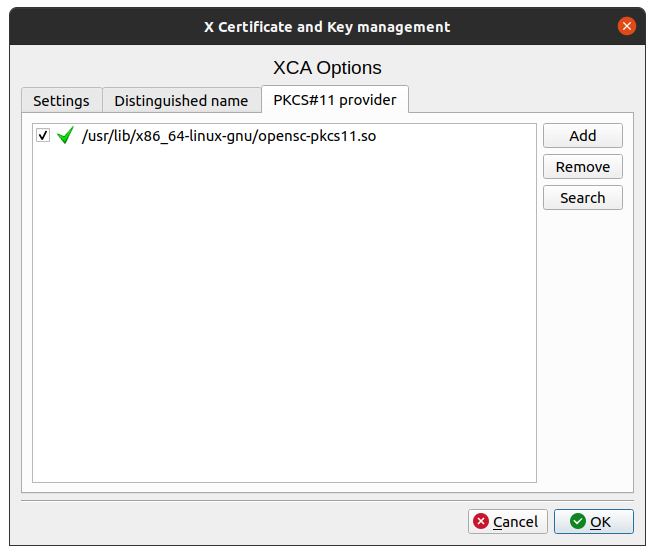
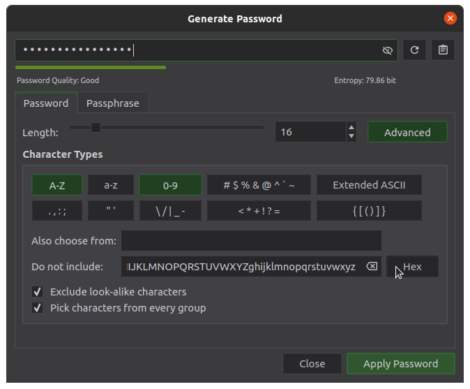

Hardware Security Module
========================

A hardware security module (HSM) is a physical computing device that safeguards
and manages digital keys, performs encryption and decryption functions for
digital signatures, strong authentication and other cryptographic functions.
These modules traditionally come in the form of a plug-in card or an external
device that attaches directly to a computer or network server. A hardware
security module contains one or more secure cryptoprocessor chips.

In this guide we will use a Nitrokey HSM for our Certificate Authority to create
and store the CA's private keys and perfrom the necessary cryptographic
operations like signing certificates.

This way private keys are kept safe on the hardware security hardware device.
All cryptographic operations are performed by the hardware device itself, the
computer and its operating system have no access to any secret material.

.. note:: The software package OpenSC version 0.19 or later is requred
    (recommended version 20.0) thefore the following instructions are valid for
    Ubuntu 20.04 Focal Fossa or newer.

Software Installation
---------------------

Ubuntu Software Packages
^^^^^^^^^^^^^^^^^^^^^^^^

* **OpenSC** - Smart card utilities with support for :term:`PKCS#15` compatible cards
* **opensc-pkcs11** - :term:`PKCS#11` module for OpenSC.
* **libengine-pkcs11-openssl** - OpenSSL engine for PKCS#11 modules
* **xca** - x509 Certification Authority management tool based on QT

::

    $ sudo apt install opensc opensc-pkcs11 xca libengine-pkcs11-openssl

Python Software Packages
^^^^^^^^^^^^^^^^^^^^^^^^

* **hsmwiz** - Frontend for OpenSC to handle HSM smartcards
* **x509sak** - X.509 Swiss Army Knife to create CA's

::

    pip3 install hsmwiz

XCA
---

PCKS#11 Provider
^^^^^^^^^^^^^^^^

We have to tell XCA which software libary it can use to access the HSM device.

In XCA create a new database first with :menuselection:`File --> New DataBase`.
The option will not be available otherwise.

Open :menuselection:`File --> Options` and got to the **PCKS#11 Provider** tab.

The OpenSC package we just installed should have placed a library in the
following location: :file:`/usr/lib/x86_64-linux-gnu/opensc-pkcs11.so`.

After that, the Token Menu becomes available.

HSM Device Initialization
^^^^^^^^^^^^^^^^^^^^^^^^^

The Nitrokey HSM device needs to be initialized as first step.

This will erase all keys, certificates and data elements on the HSM device.

Initialization requires the SO (Security Officer) PIN. Nitrokey HSM devices have
a default factory-set SO-PIN set to **"3537363231383830"**.

Select :menuselection:`Token --> Init Security token` in the menu. You will be
asked for the SO PIN, where you have to enter the default factory set.

After that you are asked to set a label for your device.

Security Officer (SO) PIN
^^^^^^^^^^^^^^^^^^^^^^^^^

As second step you should set your own SO-PIN. This only works after the
deivce has been properly initialized.

The SO PIN is needed to reset a Nitrokey HSM to its factory defaults (erasing
all keys, certificates and data on the device). The SO PIN can also set the a
new user PIN and unblock the user PIN, in case it is blocked.

The SO PIN has a retry counter of 15 and can not be unblocked. This means, that
after entering 15 times a wrong SO PIN, it will no longer be possible to reset
the HSM device.

The SO PIN **must** be 16 characters long and can only contain **hexadecimal
characters** (0-9 and abcdef).

To set your own, first generate a random PIN and store it in a safe place. I
recommend to use :doc:`/desktop/secrets/keepassxc`, which has a convenient HEX
Button in its password generator.

User PIN
^^^^^^^^

The User PIN is needed for all Nitrokey HSM operations.
IT can be 6 to 8 digits long and should only contain numbers.

The default factory-set SO-PIN on Nitrokey HSM devices is **"123456"**.

You need to change that to your own secret PIN. Six digits should be
sufficient, as it will be blocked after the third attempt with a wrong PIN.

If blocked, the SO PIN is needed to unblock it.

You can chage the user PIN by either providing the existing or factory-set one:

Select :menuselection:`Token --> Change PIN` from the menu in XCA.

Or you can set a new user PIN rigtht away by providing the SO PIN:

Select :menuselection:`Token --> Init PIN` from the menu in XCA.

References
----------
* `Getting started with Nitrokey HSM and GNU/Linux <https://www.nitrokey.com/de/documentation/installation#p:nitrokey-hsm&os:linux>`_
* `Using the Nitrokey HSM with a Certificate Authority <https://www.nitrokey.com/documentation/applications#p:nitrokey-hsm&os:linux&a:pki--certificate-authority-ca>`_

